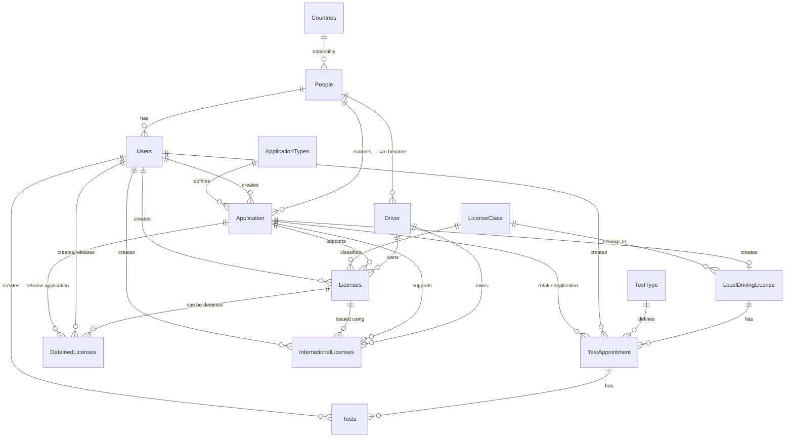

# DVLD - Driving & Vehicle License Department System

A full-stack **Driving & Vehicle License Department (DVLD)** management system built with a **desktop client** and a **RESTful ASP.NET Core Web API**. The system manages people, users, applications, driving tests, local and international licenses, detained licenses, and the complete workflow required to issue and manage driving licenses.

The project was designed with a clear separation between the presentation, business, data-access, and API layers, with SQL Server handling persistent data and business operations through stored procedures.

---

## 📌 Project Overview

DVLD is a desktop-based management system that simulates the workflow of a driving and vehicle license department.

The system allows authorized users to:

- Manage people and their personal information.
- Manage system users and their accounts.
- Create and manage driving-license applications.
- Manage different application types and fees.
- Manage driving-license classes.
- Register drivers.
- Schedule and manage driving tests.
- Record test results and track previous attempts.
- Issue, renew, replace, deactivate, and manage local driving licenses.
- Issue and manage international driving licenses.
- Detain and release driving licenses.
- Track application and license history.
- Search and filter records efficiently.
- Enforce business rules and validation at the server/database level.

---

## 🏗️ Architecture

The project follows a layered architecture with a desktop client communicating with the server through HTTP APIs.

```text
┌──────────────────────────────┐
│       WinForms Client        │
│     Presentation Layer       │
└──────────────┬───────────────┘
               │ HTTP / REST
               ▼
┌──────────────────────────────┐
│      ASP.NET Core Web API    │
│          API Layer           │
└──────────────┬───────────────┘
               ▼
┌──────────────────────────────┐
│       Business Layer         │
│   Business Rules & Services  │
└──────────────┬───────────────┘
               ▼
┌──────────────────────────────┐
│       Data Access Layer      │
│       ADO.NET + SQL Server   │
└──────────────┬───────────────┘
               ▼
┌──────────────────────────────┐
│          SQL Server          │
│ Tables / Views / Procedures  │
└──────────────────────────────┘
```

### Main architectural concepts

- Separation of Concerns
- Layered Architecture
- RESTful APIs
- DTO-based communication
- Business/service layer
- Data Access Layer
- ADO.NET
- Dependency Injection
- Async programming
- SQL Server stored procedures
- Database transactions
- Centralized API client communication

---

## 🖥️ Client Application

The client is a **Windows Forms application** that provides the user interface for the DVLD system.

The WinForms application communicates with the server through the ASP.NET Core Web API instead of accessing the database directly.

### Client responsibilities

- Display and manage application screens.
- Collect and validate user input.
- Communicate with API endpoints using `HttpClient`.
- Work with DTOs returned by the API.
- Display people, users, drivers, applications, tests, and licenses.
- Handle searching and filtering.
- Provide forms for creating and updating records.
- Manage user interaction and application workflow.

---

## 🌐 Server Application

The server is implemented using **ASP.NET Core Web API**.

It acts as the central entry point between the desktop client and the database.

### Server responsibilities

- Expose RESTful API endpoints.
- Validate incoming requests.
- Apply business rules.
- Convert between entities and DTOs.
- Handle authentication-related operations.
- Communicate with the Data Access Layer.
- Return appropriate HTTP responses.
- Centralize database access behind the API.

---

## 🗄️ Database

The project uses **Microsoft SQL Server**.

The database is organized around the main entities of a driving-license department.

### Main tables

| Table | Purpose |
|---|---|
| `People` | Stores personal information of applicants and system users. |
| `Countries` | Stores nationality/country information. |
| `Users` | Stores system user accounts and account status. |
| `Application` | Stores general applications submitted by people. |
| `ApplicationTypes` | Defines application types and their fees. |
| `LicenseClass` | Defines driving-license classes, requirements, validity, and fees. |
| `Driver` | Represents registered drivers. |
| `LocalDrivingLicense` | Connects a driving application with a license class. |
| `Licenses` | Stores issued local driving licenses. |
| `InternationalLicenses` | Stores international driving licenses. |
| `TestType` | Defines available driving test types and fees. |
| `TestAppointment` | Stores scheduled driving-test appointments. |
| `Tests` | Stores the actual test results. |
| `DetainedLicenses` | Stores detained licenses and their release information. |

The database schema contains primary keys, foreign keys, unique constraints, default values, views, stored procedures, and transactional operations.

---

## 🔗 Database Relationships

The core relationship flow can be summarized as follows:

```text
People
  │
  ├──────────────► Users
  │
  ├──────────────► Driver
  │                    │
  │                    ├────────► Licenses
  │                    │              │
  │                    │              └──────► DetainedLicenses
  │                    │
  │                    └────────► InternationalLicenses
  │
  └──────────────► Application
                         │
                         ├────────► ApplicationTypes
                         │
                         └────────► LocalDrivingLicense
                                         │
                                         ├────────► LicenseClass
                                         │
                                         └────────► TestAppointment
                                                        │
                                                        ├────────► TestType
                                                        │
                                                        └────────► Tests

People ───────────────► Countries
```

### ER Diagram



---

## 👤 People Management

The People module manages the personal data used throughout the system.

Stored information includes:

- National number
- First, second, third, and last names
- Date of birth
- Gender
- Address
- Phone
- Email
- Nationality
- Image path

The database enforces uniqueness for the national number.

---

## 🔐 User Management & Security

The system provides user-account management with:

- Unique usernames
- Active/inactive user status
- User-to-person relationship
- Login using username and password
- User-related database operations
- Password hashing

### Password Security

Passwords are **hashed using SHA-256** before being stored and compared.

---

## 📝 Application Management

The system uses a general `Application` entity as the foundation for many department workflows.

Each application contains:

- Applicant
- Application date
- Application type
- Application status
- Last status date
- Paid fees
- Creating user

Application statuses are represented in the database as:

```text
1 = New
2 = Cancelled
3 = Completed
```

Application types are stored separately, allowing their titles and fees to be managed independently.

---

## 🚗 Driving License Classes

The `LicenseClass` table defines the different categories of driving licenses.

Each class contains:

- Class name
- Description
- Minimum allowed age
- Default validity period
- Fees

This allows the system to apply different requirements and fees depending on the selected license class.

---

## 🚘 Drivers

A person can be registered as a driver.

The `Driver` entity keeps track of:

- Driver ID
- Person
- Creating user
- Creation date

The database also provides a driver view that combines driver and personal information and calculates the number of active licenses.

---

## 🪪 Local Driving Licenses

The local driving-license workflow connects several parts of the database:

```text
Person
   ↓
Application
   ↓
Local Driving License Application
   ↓
License Class
   ↓
Tests & Appointments
   ↓
Driver
   ↓
Local License
```

The system supports operations such as:

- Creating a local driving-license application.
- Checking whether the person already has an application for the same class.
- Scheduling tests.
- Recording test results.
- Tracking test attempts.
- Issuing the license after completing the required workflow.
- Renewing licenses.
- Replacing lost or damaged licenses.
- Deactivating licenses.
- Viewing license history.

---

## 🧪 Driving Tests

The test subsystem consists of:

### Test Types

Each test type has:

- Title
- Description
- Fees

### Test Appointments

Appointments contain:

- Test type
- Local driving-license application
- Appointment date
- Fees
- Lock status
- Optional retake application
- Creating user

### Tests

The actual test result contains:

- Test appointment
- Result
- Notes
- Creating user

The system can also determine:

- Number of attempts.
- Number of passed tests.
- Latest test result.
- Whether an appointment is locked.
- Whether an active appointment already exists.

When a test is recorded, the related appointment is locked through a database transaction.

---

## 🌍 International Driving Licenses

The system supports issuing and managing international driving licenses.

An international license is connected to:

- Driver
- Application
- Local license used for issuance
- Issue date
- Expiration date
- Active status
- Creating user

The database automatically evaluates whether an international license is still active based on its expiration date.

---

## 🚔 Detained Licenses

The system supports license detention and release workflows.

A detained license stores:

- License ID
- Detention date
- Detention fees
- Creating user
- Release status
- Release date
- Releasing user
- Release application

The release process is handled transactionally:

```text
Create Release Application
          ↓
Validate Detained License
          ↓
Mark License as Released
          ↓
Store Release Date/User/Application
```

If an operation fails, the transaction is rolled back.

---

## 🗃️ Database Views

The database includes views to simplify complex queries and provide ready-to-display data.

### `Driver_View`

Combines:

- Driver information
- Person information
- National number
- Full name
- Creation date
- Number of active licenses

### `LocalDrivingLicenseApplications`

Combines:

- Local application ID
- Driving class
- National number
- Full name
- Application date
- Number of passed tests
- Application status

This keeps frequently used reporting/query logic inside the database rather than duplicating it across the application.

---

## ⚙️ Stored Procedures

The database uses stored procedures extensively for CRUD operations, searching, validation, and business workflows.

Examples include:

- Creating and updating people.
- Creating and updating users.
- Creating applications.
- Creating drivers.
- Creating local driving-license applications.
- Creating local licenses.
- Creating international licenses.
- Creating test appointments.
- Recording tests.
- Searching for people, drivers, licenses, users, and applications.
- Checking whether records already exist.
- Counting test attempts.
- Checking passed tests.
- Detaining and releasing licenses.
- Updating and deactivating licenses.

Stored procedures also use:

- Parameters
- Output parameters
- `SCOPE_IDENTITY()`
- Transactions
- `TRY...CATCH`
- Custom SQL errors
- Validation checks

---

## 🔄 Transactional Operations

Critical workflows use SQL Server transactions to maintain database consistency.

Examples include:

- Creating a local driving-license application.
- Issuing a license.
- Creating an international license.
- Releasing a detained license.
- Recording a test and locking its appointment.
- Updating related application/license information.

For example:

```text
BEGIN TRANSACTION
      ↓
Perform related operations
      ↓
Everything succeeds?
   ↙          ↘
 YES           NO
  ↓             ↓
COMMIT       ROLLBACK
```

This prevents partially completed operations from leaving the database in an inconsistent state.

---

## 🧩 Technology Stack

### Client

- C#
- Windows Forms
- .NET
- `HttpClient`
- REST API communication
- DTOs
- Async/Await

### Server

- C#
- ASP.NET Core Web API
- .NET 8
- RESTful APIs
- DTOs
- Business Layer
- Data Access Layer
- Dependency Injection
- Async/Await

### Database

- Microsoft SQL Server
- T-SQL
- ADO.NET
- Stored Procedures
- Views
- Foreign Keys
- Transactions
- Constraints

### Security

- SHA-256 password hashing
- Authentication
- Active/inactive user accounts
- Parameterized database commands

---

## 📁 Project Structure

A simplified representation of the solution structure:

```text
DVLD
│
├── DVLD.WinForms
│   ├── Forms
│   ├── Controls
│   ├── Services
│   ├── Helpers
│   └── Resources
│
├── DVLD.API
│   ├── Controllers
│   └── API Configuration
│
├── DVLD.Business
│   └── Business Services
│
├── DVLD.DataAccess
│   └── SQL / ADO.NET Data Access
│
├── DVLD.DTOs
│   └── Request / Response DTOs
│
├── DVLD.Shared
│   └── Shared Entities / Enums
│
└── Database
    └── database.sql
```

> The exact project/folder names may differ depending on the repository organization, but the architecture follows the same separation of responsibilities.

---

## 🚀 Getting Started

### 1. Clone the repository

```bash
git clone <YOUR_REPOSITORY_URL>
```

### 2. Restore the database

Open the provided SQL database script:

```text
database.sql
```

Execute it using SQL Server Management Studio.

The script creates:

- Database
- Tables
- Relationships
- Constraints
- Views
- Stored Procedures

### 3. Configure the API

Update the API connection string in the server configuration.

Example:

```json
{
  "ConnectionStrings": {
    "DefaultConnection": "Server=YOUR_SERVER;Database=DVLD;Trusted_Connection=True;TrustServerCertificate=True;"
  }
}
```

### 4. Configure the WinForms client

Update the API base URL in the client configuration so that the desktop application can communicate with the running ASP.NET Core API.

### 5. Run the API

Start the ASP.NET Core Web API project.

### 6. Run the WinForms Client

Start the desktop client after the API is running.

---

## 🎯 Main Features

- 👤 People Management
- 👨‍💼 User Management
- 🔐 Authentication
- 🔑 SHA-256 Password Hashing
- 📝 Application Management
- 🚗 Driver Management
- 🪪 Local Driving License Management
- 🌍 International License Management
- 🚔 Detained License Management
- 🧪 Driving Test Management
- 📅 Test Appointment Scheduling
- 🔄 License Renewal
- ♻️ Lost/Damaged License Replacement
- 📋 License History
- 🔎 Search & Filtering
- 💰 Application and License Fees
- 📊 Database Views
- ⚙️ Stored Procedures
- 🔄 Transactional Business Operations
- 🌐 RESTful API Communication

---

## 💡 Key Technical Highlights

This project demonstrates practical experience with:

- Designing a relational database from a real-world domain.
- Modeling complex relationships using foreign keys.
- Building a multi-layered application.
- Separating the desktop UI from database access using a Web API.
- Designing DTOs for client/server communication.
- Using ADO.NET for database access.
- Writing and consuming SQL Server stored procedures.
- Implementing transactional business workflows.
- Handling asynchronous API/database operations.
- Applying validation and business rules.
- Managing user authentication and password hashing.
- Building reusable WinForms components and services.

---

## 📌 Database Design Highlights

The database enforces important integrity rules, including:

- Primary keys for all major entities.
- Foreign-key relationships between related entities.
- Unique national numbers.
- Unique usernames.
- Default application status.
- Nullable release information for detained licenses.
- Referential relationships between applications, people, drivers, licenses, and tests.

For example, the `People` table enforces a unique constraint on `NationalNo`, while `Users` enforces a unique constraint on `Username`.

---

## 🧠 Business Workflow Example

A typical local driving-license workflow can be represented as:

```text
Register Person
      ↓
Create Driving Application
      ↓
Select License Class
      ↓
Schedule Required Tests
      ↓
Take Tests
      ↓
Record Results
      ↓
Complete Application
      ↓
Register Driver
      ↓
Issue Local Driving License
      ↓
Manage / Renew / Replace License
```

The system also supports additional workflows such as international license issuance and detained-license release.

---

## 🔒 Security Note

Passwords should never be stored as plain text.

This project hashes passwords using **SHA-256** before storing them in the database.

---

## 📄 License

This project is intended for educational and portfolio purposes.

---

## 👨‍💻 Author

**Adham Gomaa**

Technologies of interest:

- C#
- .NET
- ASP.NET Core
- WinForms
- SQL Server
- REST APIs
- ADO.NET
